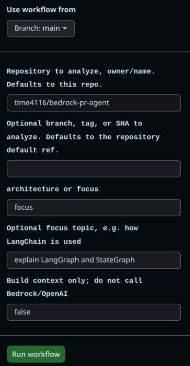

# repocaster

Turn a GitHub repository into a focused AI generated audio briefing.

Repocaster runs in two modes:

1. **GitHub App mode** — comment `/podcast` or `/podcast focus <topic>` on an issue or PR. On PR comments, Repocaster includes the pull request diff and changed file summary so the episode is grounded in the proposed change, not just the whole repo. It scans the repository, generates a 6 to 8 minute two host briefing, uploads the MP3 to S3, and comments back with a presigned URL.
2. **Owner only GitHub Actions workflow** — manually run the workflow in this Repocaster repo with repository/ref/focus inputs. This uses repo secrets and is intended for personal portfolio/demo use without requiring anyone to install the GitHub App.

## Why

Repocaster is for engineering onboarding, architecture handoffs, and focused codebase deep dives. Instead of another chatbot, it produces a portable audio explanation of how a repository works.

## Live demo

This repo includes a public working example generated by the owner-only GitHub Actions workflow:

- Output: [open the embedded audio player](https://time4116.github.io/repocaster/example.html)
- Workflow run: [`26367720035 / repocaster`](https://github.com/time4116/repocaster/actions/runs/26367720035/job/77614326945)
- Target repo: [`time4116/bedrock-pr-agent`](https://github.com/time4116/bedrock-pr-agent)
- Focus: `explain LangGraph and StateGraph`
- What to look for:
  - cross-repo analysis from a manual workflow
  - generated two-host technical briefing
  - embedded MP3 player page, not just a raw download link

Secondary download: [MP3 in the repo](docs/assets/repocaster-bedrock-pr-agent-langgraph.mp3)



## Example commands

```text
/podcast
/podcast focus how LangChain and LangGraph are used
/podcast focus deployment pipeline and GitHub Actions
```

When those commands are used on a pull request, Repocaster adds a synthetic `PULL_REQUEST.md` context file with the PR number, changed files, diff stat, and a bounded diff excerpt. For local or manual workflow runs, pass a PR number explicitly:

```bash
repocaster --repo . --pull-request 42 --mode focus --focus "explain the proposed change" --dry-run
```

## Default constraints

- Minimum target duration: 6 minutes
- Default target duration: 6 to 8 minutes
- LLM: AWS Bedrock
- TTS: OpenAI TTS
- Output: private S3 object with presigned URL
- S3 lifecycle: generated objects expire after 10 days
- Weekly quota: S3 backed, per repo and optional global limit
- App mode: repo allowlist and author allowlist required
- Workflow mode: manual `workflow_dispatch`, owner guarded, no PR trigger

## High level architecture

```text
GitHub comment or manual workflow
        │
        ▼
Command parser / workflow inputs
        │
        ▼
Repo scanner + focus aware context pack
        │
        ▼
LangGraph pipeline
  collect_context → generate_script → synthesize_audio → publish_result
        │
        ▼
S3 MP3 + GitHub comment or Actions artifact
```

## Local CLI preview

```bash
python -m repocaster.cli --repo . --mode architecture --dry-run
python -m repocaster.cli --repo . --mode focus --focus "how LangGraph is used" --dry-run
python -m repocaster.cli --repo . --pull-request 42 --mode focus --focus "review the PR" --dry-run
```

`--dry-run` builds the context pack and script request metadata without calling Bedrock or OpenAI.

## Bootstrap prerequisites

Before running non dry-run generation, follow the one-time setup in [`SETUP.md`](SETUP.md): create the private S3 output bucket with 10 day lifecycle expiration, create the GitHub Actions OIDC role, configure GitHub secrets/vars, and create the GitHub App for hosted bot mode.

## GitHub Actions mode

The workflow is intentionally manual and owner guarded. It checks out Repocaster separately from the target repository, so `repository` can point at another `owner/name` repo when you want to generate a briefing for something other than `time4116/repocaster`. Set `pull_request` to a PR number or GitHub PR URL when you want the briefing grounded in a specific proposed change.

```yaml
name: Repocaster

on:
  workflow_dispatch:
    inputs:
      repository:
        description: "Repository to analyze, owner/name. Defaults to this repo."
        required: false
        default: ""
      ref:
        description: "Optional branch, tag, or SHA to analyze. Defaults to the repository default ref."
        required: false
        default: ""
      mode:
        description: "architecture or focus"
        required: false
        default: "architecture"
      focus:
        description: "Optional focus topic, e.g. how LangChain is used"
        required: false
        default: ""
      pull_request:
        description: "Optional pull request number or URL to ground the briefing"
        required: false
        default: ""

jobs:
  repocaster:
    if: github.actor == 'time4116'
    runs-on: ubuntu-latest
    permissions:
      contents: read
      id-token: write
    steps:
      - name: Checkout Repocaster
        uses: actions/checkout@v4
        with:
          path: repocaster-action
      - name: Checkout target repository
        uses: actions/checkout@v4
        with:
          repository: ${{ inputs.repository || github.repository }}
          ref: ${{ inputs.ref }}
          path: target-repo
      - uses: actions/setup-python@v5
        with:
          python-version: '3.11'
      - run: pip install -e repocaster-action
      - run: |
          args=(
            --repo "$GITHUB_WORKSPACE/target-repo"
            --mode "$REPOCASTER_MODE"
            --output output/repocaster.mp3
          )
          if [ -n "$REPOCASTER_FOCUS" ]; then
            args+=(--focus "$REPOCASTER_FOCUS")
          fi
          if [ -n "$REPOCASTER_PR" ]; then
            args+=(--pull-request "$REPOCASTER_PR")
          fi
          repocaster "${args[@]}"
        env:
          REPOCASTER_MODE: ${{ inputs.mode }}
          REPOCASTER_FOCUS: ${{ inputs.focus }}
          REPOCASTER_PR: ${{ inputs.pull_request }}
          AWS_REGION: ${{ vars.AWS_REGION || 'us-east-1' }}
          BEDROCK_MODEL_ID: ${{ secrets.BEDROCK_MODEL_ID }}
          OPENAI_API_KEY: ${{ secrets.OPENAI_API_KEY }}
```

## Running locally

Install the package in editable mode, then start with dry-run previews:

```bash
python -m pip install -e .
repocaster --repo . --mode architecture --dry-run
repocaster --repo . --mode focus --focus "deployment pipeline" --dry-run
repocaster --repo . --pull-request 42 --mode focus --focus "review the PR" --dry-run
```

Non-dry-run generation requires AWS Bedrock, OpenAI, ffmpeg, and the environment described in [`SETUP.md`](SETUP.md).
